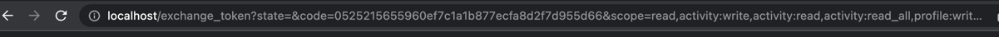
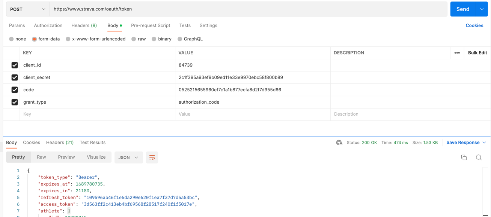
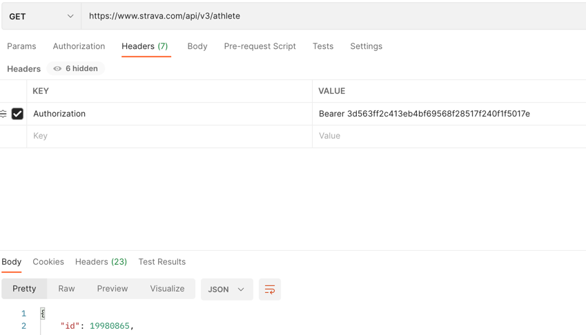

# Strava Challenge Python

This project is a set of automated tests for integration with the Strava API, a platform for fitness activities. It performs tests on various API endpoints to ensure correct functionality and integration with the system.

The tests cover features such as user authentication, retrieval of athlete profile information, activity creation, and other related operations.

The goal of this project is to apply and enhance knowledge in Python, as well as utilize the advanced features of Pytest to comprehensively test the various API endpoints.
## Features
- User authentication and authorization
- Retrieval of athlete profile information
- Activity creation and management
- Security and confidentiality testing
- Verification of API response structure and formats
  
## Requirements

- Python: 3.11.4
- pipenv: version 2023.7.11
- Strava account

## Installation

Clone this repository to your local machine:

```shell
git clone https://github.com/hassifernando/strava-challenge-python.git
```
Navigate to the project directory:

```
cd strava-challenge-python
```
Install the necessary dependencies:

```
pipenv install
```

## Running the Tests

To run the automated tests, follow the steps below:

Create and configure your .env file, the .env file should be in the root of project

```
STRAVA_USERNAME='username-string'
STRAVA_CITY='city-string'
STRAVA_CLIENT_ID='int'
STRAVA_CLIENT_SECRET='cliente-secret'
STRAVA_REFRESH_TOKEN='refresh-token'
STRAVA_ATHLETE_ID = 'int'
```

##### Where you can get the data to build the .env?

* ###### Username and City: https://www.strava.com/settings/profile
* ###### Client ID and Client Secret: https://www.strava.com/settings/api
* ###### Refresh Token:

    > We will need a token with scope to read and write, to get this follow this instructions:

    Access this [link](    https://www.strava.com/oauth/authorize?client_id=CLIENT_ID&response_type=code&redirect_uri=http://localhost/exchange_token&approval_prompt=force&scope=activity:write,profile:write,activity:read_all,profile:read_all,read_all,activity:read
), change the CLIENT_ID to your CLIENT_ID and reload:

    You will be redirect to this url:

    

    > Save the **code** content.

    Use the Postman to do a POST request (https://www.strava.com/oauth/token) and get your refresh token:
    > Change the values for your values and your code for the previous step
  
  

    > Save the refresh_token into the .env


* ###### Athlete ID: GET Request against https://www.strava.com/api/v3/athlete

   

  Get the ID in response and save into your .env

Navigate to the project directory:

```
cd strava-challenge-python
```

Execute the following command to run all tests:
```
pytest
```
If you prefer to run specific tests:
```
 pytest -k test_create_activity tests/test_activities.py
```

